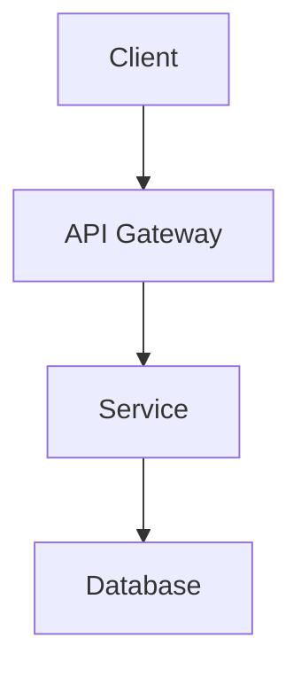

# Architecture Spec: [Component or System Name]

## Metadata
- **ID:** ARCH-XXX
- **Status:** Draft | Review | Approved
- **Author:**
- **Created:** YYYY-MM-DD

---

## Overview
<!-- High-level description of this architectural component -->

## Goals
- 
- 

## Constraints
- 

---

## Architecture Diagram
<!-- Use Mermaid or link to a diagram file -->

---

## Components

### Component Name
- **Responsibility:**
- **Technology:**
- **Interfaces:**

---

## Data Flow
1. Step 1
2. Step 2

## Key Decisions

### Decision: [Title]
- **Context:**
- **Options considered:**
- **Decision:**
- **Rationale:**

---

## Security Considerations

## Scalability Considerations

## Related Specs
- [FEAT-XXX](../features/FEAT-XXX.md)
- [API-XXX](../api/API-XXX.md)
