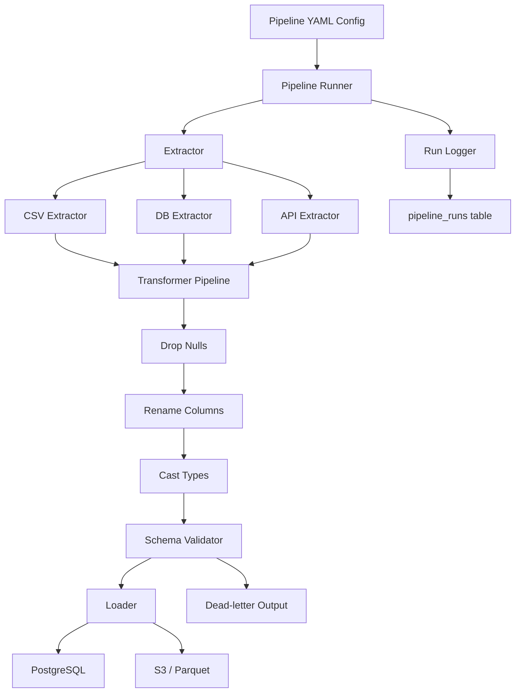

# Architecture Spec: System Overview

## Metadata
- **ID:** ARCH-001
- **Status:** Approved
- **Author:** Platform Team
- **Created:** 2024-01-10
- **Updated:** 2024-01-15

---

## Overview

The internal ETL pipeline is a batch data movement system. It reads data from internal source systems (databases, file exports, internal APIs), applies a configurable transformation chain, and writes output to target destinations (PostgreSQL, S3). Each pipeline is a YAML-configured unit of work executed by a single Python process.

---

## Architecture Diagram

---

## Components

### Pipeline Runner (`src/pipeline.py`)
- **Responsibility:** Orchestrates the full ETL execution lifecycle
- **Technology:** Python 3.11, Pydantic for config validation
- **Interfaces:** Reads YAML config, instantiates Extractor/Transformer/Loader, drives the main loop

### Extractors (`src/extractors/`)
- **Responsibility:** Read raw data from source systems in chunks
- **Technology:** `csv` stdlib, `psycopg2` (DB), `httpx` (API)
- **Interfaces:** Implements `BaseExtractor`; yields `list[dict]` chunks

### Transformers (`src/transformers/`)
- **Responsibility:** Clean, validate, and reshape data
- **Technology:** Pure Python + Pydantic v2 for schema validation
- **Interfaces:** Implements `BaseTransformer`; accepts and returns `list[dict]`

### Loaders (`src/loaders/`)
- **Responsibility:** Write data to destination systems
- **Technology:** `psycopg2` (PostgreSQL), `boto3` + `pyarrow` (S3/Parquet)
- **Interfaces:** Implements `BaseLoader`; accepts `list[dict]` chunks

### Run Logger (`src/utils/logger.py`)
- **Responsibility:** Structured logging for every pipeline run
- **Technology:** Python `logging` + `structlog`
- **Interfaces:** Writes JSON logs to stdout; optionally writes run metadata to `pipeline_runs` DB table

---

## Data Flow

1. Runner reads and validates YAML config via Pydantic model
2. Runner instantiates configured Extractor, TransformerPipeline, and Loader
3. Extractor connects to source and begins yielding chunks
4. Each chunk passes through the full TransformerPipeline
5. Valid rows are passed to the Loader; invalid rows accumulate in `dead_letter`
6. Loader writes each chunk within a single transaction
7. After all chunks are processed, Loader commits
8. Runner writes run summary (rows extracted, transformed, loaded, rejected) to logger
9. On any failure: Loader rolls back; Runner logs error with full traceback; exits code 1

---

## Key Decisions

### Decision: Chunk-based processing
- **Context:** Pipelines may process millions of rows; loading full dataset into memory is not viable
- **Options:** Load all at once vs. generator-based chunking
- **Decision:** Generator-based chunking throughout (extractor → transformer → loader)
- **Rationale:** Keeps peak memory bounded regardless of dataset size

### Decision: YAML config + Pydantic validation
- **Context:** Pipelines are authored by non-engineers; config must be readable and validated
- **Options:** Python DSL, JSON, YAML
- **Decision:** YAML with Pydantic schema validation at startup
- **Rationale:** YAML is human-friendly; Pydantic catches misconfiguration before any data moves

### Decision: Single-process, no distributed execution in v1
- **Context:** Internal tooling with modest scale (up to ~10M rows / run)
- **Options:** Single process, Celery workers, Spark
- **Decision:** Single Python process for v1
- **Rationale:** Simpler ops, no infra overhead; Airflow handles scheduling and parallelism at the DAG level

---

## Security Considerations
- All credentials (DSNs, API tokens) are injected via environment variables; never hardcoded in YAML
- S3 access via IAM role (no long-lived AWS keys in config)
- DB connections use SSL in production (`sslmode=require`)

## Scalability Considerations
- Chunk size is configurable per pipeline — tune for memory vs. throughput tradeoff
- For pipelines exceeding 50M rows, consider switching `DBExtractor` to use PostgreSQL `COPY` protocol
- S3Loader can be upgraded to per-chunk multipart upload for very large outputs

---

## Related Specs
- [FEAT-001](../features/FEAT-001-pipeline-runner.md) — Pipeline Runner
- [FEAT-002](../features/FEAT-002-extractor-base.md) — Extractor Base
- [FEAT-003](../features/FEAT-003-transformer-base.md) — Transformer Base
- [FEAT-004](../features/FEAT-004-loader-base.md) — Loader Base
- [ARCH-002](./ARCH-002-data-flow.md) — Data Flow Detail
